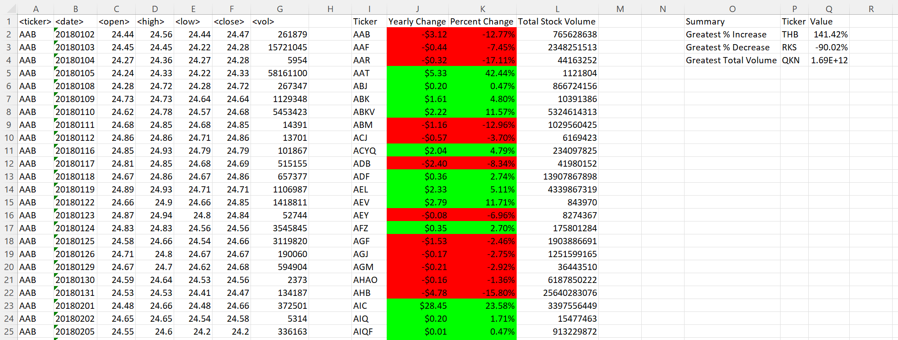

# VBA_challenge
 VBA_Scripting_Multiyear_Stock_Data

 # Welcome to Stock Data Analysis Project

# Introduction

- It is the VBA Challenge Project for which I write scripts to implement conditonal formating, relative calculations and summary for getting the highest increases, decreases and total stock volume for each provided year data i.e. 2018, 2019 and 2020.

- This scripts works and execute successfully for all the sheets in the provided workbook.

# Features of the Script

- This VBA script will execute on all provided sheets.

- It allows to retrieve the data in Output Table for all tickers.

- Calculates the Yearly Change and Percent Change along with their total stock volume.

- Results the summary for the Greatest Increase/Decrease and Greatest Total Volume for each year.

# Execution of the Script

- I declare all the variables for values in the required columns and summary vaues.

- Initialize the necessary values to make calculations

- Setup to determine the last row for all sheets

- Put headers and titles with respective to the required locations.

- Using a loop I find the change in ticker values, yearly changem percent change and the total stock display on the columns values.

- Fomrat the color coding for negative and positive values using "Select" statement.

- Set the percentages and $ symbol for Yearly Change for the currency fromat.

- Summairzed the highest increase and decrease with Total Stock Volume of the Years.

- Auto adjustment for the columns headrer, their values and summary table in also done.

# Analysis

- For years 2018, 2019 and 2020 we can depicts:

- The greatet increase was observed in 2019 and 2020 with 190 and 188 percent.

- Although, the tickers associated with the greatest decrease are different, however the extent of greatest decresed is almost similar for all the years.
 
- MAximum value of  greatest total volume was observed in 2019, while the minimum value was observed in 2018.  

- All greatest ticker are different in every year.

# Snapshots

## 2018 

## 2019

## 2020

